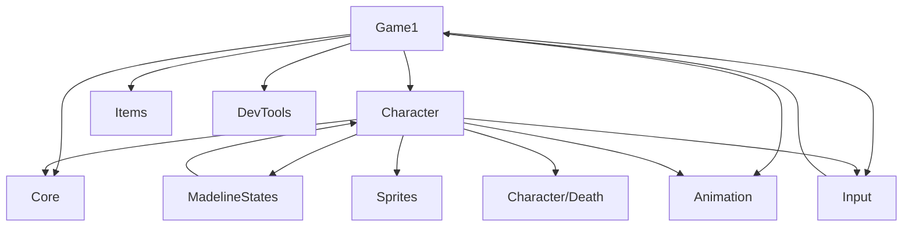

General ReadMe for the full project, each person can detail their objectives, struggles, and future To-Dos.

Group name: Strawberry
Group members: Aaron, Henry, Isaac, Albert, Sihao, Zijun

Sprint 2: Due Feb 21
Grader CheckIn: Monday, Feb 16
In Class Code Check: Friday, Feb 20

---

## Controls

- **Move:** A / D or Left / Right arrows
- **Jump:** Space
- **Dash:** Enter, Z, or N
- **Death:** E   (For Test & Show only)
- **Quit:** Escape (or Back on gamepad) or Q
- **Restart:** R
- **Cycle Block Forward & Backward:** Y & T
- **Cycle Item Forward & Backward:** U & I
- **Block animation:** B toggles animation for the currently displayed block (spring, move block, crush block). When off, blocks are stationary.
- **Block display:** V toggles whether the current block/obstacle is shown at all (on by default).
- **Debug overlay (G):** G toggles; P pause, Tab/Backspace cycle animation, arrows step frame, W/S/A/D nudge hair anchor, C crosshair. See `Celeste/Animation/README.md` for full debug keys.

---

## Known bugs

---

## Tools

- **strip_builder.py** — Builds horizontal sprite strips from frame PNGs (e.g. `Madeline_Assets/Animations/player/idleD/` → `Content/idleD.png`). Requires Pillow; run via venv if system Python is externally managed.
- **Animation system** — `Celeste/Animation/README.md` documents the catalog, loader, and debug mode.

---

## Celeste file structure

Current layout after the organizational refactor (moves/renames only; no functionality changes):

```
Celeste/Celeste/
  Core/
    Constants/
      GlobalConstants.cs   # Global scale only
      PlayerConstants.cs   # Player frame size, movement, physics
      ItemConstants.cs     # Item display positions
      BlockConstants.cs    # Block display position
    GameLoopInterfaces.cs
  Character/
    Madeline.cs            # Player entity (sprite, state machine, physics, death)
    Death/                 # Death sequence (sprite + particles + orbit ring); namespace Celeste.DeathAnimation
      DeathEffect.cs, DeathSpritePlayer.cs, ClipPlayer.cs, OrbitRingEffect.cs
      Utils/Easings.cs
      Particles/ (ProceduralParticleTexture, ParticleSystem, Particle, Emitters/)
  MadelineStates/          # Player state machine (stand, run, jump, fall, dash, death)
  Input/
    PlayerCommand.cs       # Movement/jump/dash/death from keyboard
    ICommand.cs, GameCommands.cs, IController.cs, KeyboardController.cs, ControllerLoader.cs
  Animation/               # Catalog, clips, controller, loader, keys
  Sprites/                 # MaddySprite, BodySprite, HairRenderer, hair/bangs data
  Items/                   # ItemAnimation, ItemAnimator, ItemAnimationFactory (namespace Celeste.Items)
  DevTools/ (DebugOverlay.cs)
  Game1.cs, Program.cs
```

**Dependency overview:**



**What was consolidated:** Madeline/Character.cs → Character/Madeline.cs; GamePlay (2 files) → Core/GameLoopInterfaces.cs; constants → Core/Constants/ (GlobalConstants, PlayerConstants, ItemConstants, BlockConstants); Command + Controller + Input → single Input/ folder; DeathAnimation → Character/Death/; CollectableItems → Items/. All moves/renames only; behavior unchanged.

---

## Tasks assigned to individuals

Aaron: Controller functionality and Command functionality to seperate controls from specific objects.

Albert: Finish the death animation 

Henry: 

Flip static hair animations to dynamic (jump, dash, idleA-idleD)


Isaac: 

Draw the blocks and "animate" the moving ones.

Sihao: 

Zijun: Finish Character, standState, runState, jumpState, fallState and dangleState.

Sprint 3: Due Mar 14
Tasks assigned to individuals: TBD
