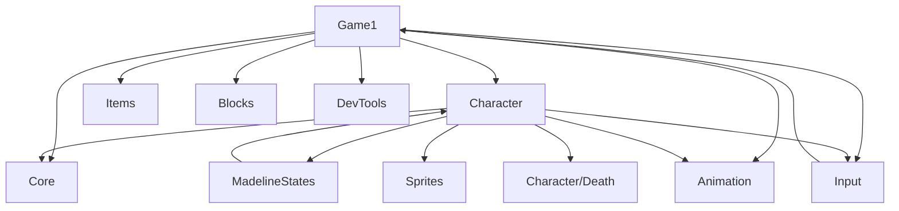

# Team Strawberry — Celeste

**Group:** Strawberry
**Members:** Aaron, Henry, Isaac, Albert, Sihao, Zijun
**Framework:** C# · MonoGame 3.8 · .NET 8.0

---

## Controls

### Player Controls

| Key(s) | Action |
|--------|--------|
| `A` / `←` | Move left |
| `D` / `→` | Move right |
| `Space` | Jump |
| `Z` / `N` / `Enter` | Dash |
| `W` (hold) | Climb |
| `E` | Trigger death sequence (test / demo only) |

### Block / Obstacle Controls

| Key | Action |
|-----|--------|
| `Y` | Cycle to next block |
| `T` | Cycle to previous block |
| `B` | Toggle block animation on / off |
| `V` | Toggle block visibility on / off |

### Item Controls

| Key | Action |
|-----|--------|
| `I` | Cycle to next item |
| `U` | Cycle to previous item |

### Other Controls

| Key(s) | Action |
|--------|--------|
| `Q` / `Escape` | Quit |
| `R` | Reset to initial state |

### Debug Mode Controls

Debug mode is for developer use only (hair anchor tuning, animation inspection).

| Key | Action |
|-----|--------|
| `G` | Toggle debug overlay |
| `P` | Pause / resume animation |
| `→` / `←` | Step one frame forward / backward (while paused) |
| `Tab` | Cycle to next animation (while paused) |
| `Backspace` | Cycle to previous animation (while paused) |
| `W` / `S` / `A` / `D` | Nudge hair anchor up / down / left / right 1 px (while paused) |
| `C` | Toggle crosshair overlay |

> Full debug workflow documented in [Celeste/Celeste/Animation/README.md](Celeste/Celeste/Animation/README.md) and [Celeste/Celeste/DevTools/DebugMode.md](Celeste/Celeste/DevTools/DebugMode.md).

---

## Sprint Progress

### Sprint 2 — Game Objects & Sprites

**Due:** Feb 21, 2025 | **Grader Check-In:** Feb 16, 2025 | **In-Class Code Check:** Feb 20, 2025

> **Scope note:** Celeste does not have traditional enemies in this sprint's scope. Enemy / NPC cycling (`O` / `P` as described in the generic sprint template) is deferred to a later sprint when adversarial entities are introduced.

---

#### Sprint 2 Tasks — Henry

- [x] Project management & all documentation
- [x] `tools/strip_builder.py` — animation strip generator helper
- [x] Dynamic hair system (jump, dash, idleA–idleD animations)
- [x] Sprite interface system (`IMaddySprite`, `IBodySprite`, `IHairSprite`)
- [x] Dash hair color configuration (red → blue → red cycle on dash use / refill)
- [x] Hair debug system (G overlay, P pause, WASD nudge, Tab cycle, C crosshair)
- [x] Full repo refactor & folder reorganization

#### Sprint 2 Tasks — Aaron

 - [x] Controller and Command functionality - Create Command and Controller interfaces and classes to initialize, assign, and provide functionality to the project.
 - [ ] Player Control - Need to depreciate and integrate PlayerCommand.cs into my controller stucture
 - [x] Project Managment - Set up initial READMe, as well and began pushing other members to create branches to complete tasks in and use Git functionality to track progress.
 - [x] Code Review - Reviewed Henry's Debug system and Isaac's block branch to ensure functionality  

#### Sprint 2 Tasks — Albert

  - [x] Create classes to control in-game animations
  - [x] Added death animations for the player
  - [x] Draw in-game items to cycle through for the sprint

#### Sprint 2 Tasks — Isaac

 - [x] Create classes for drawing static and animated blocks in the game
 - [x] Add moving functionality for necessary blocks
 - [x] Add additional keyboard input (T & Y) for displaying all blocks and the "gallery" of blocks

#### Sprint 2 Tasks — Sihao

 - [x] Implement dashState, climbState and related player movement behavior 
 - [x] Debug and refine animation behavior across different player states
 - [x] Assist with testing player mechanics and ensuring stable gameplay behavior

#### Sprint 2 Tasks — Zijun

  - [x] Character class - Initialize all public characteristics, initialize all states, introduce the simplified physical system, and change the state.
  - [x] State Interface - IMadelineState
  - [x] runState - Handles horizontal movement and transitions to stand/jump/dash based on input and ground check.
  - [x] standState - Initial state. Change to other states base on input.
  - [x] jumpState - Applies initial upward velocity and switches to fall when vertical velocity becomes positive. Permit change to dash state during jumping.
  - [x] fallState - Applies gravity-driven descent and returns to stand upon landing. Permit change to dash state during falling.
  - [x] dangleState - Transitions to climb/jump/fall depending on input and contact.

---

### Sprint 3 — (Due Mar 14, 2025)

Tasks assigned to individuals: TBD

### Sprint 4 — (TBD)

Tasks assigned to individuals: TBD

### Sprint 5 — (TBD)

Tasks assigned to individuals: TBD

---

## Sprint Tracking Methodology

To maintain clean, consistent task tracking across all sprints:

1. **Each sprint gets its own section** in this README (see above), with a header, due date, and grader check-in date.
2. **Each team member has a checklist** using GitHub-flavored Markdown task syntax:
   - `- [x]` = completed
   - `- [ ]` = pending / in progress
3. **Responsibility:** Each team member updates their own checklist section before the sprint due date. Henry manages the overall structure and methodology.
4. **Scaling:** For each new sprint, copy the previous sprint's section as a template, clear the checkboxes, update the due dates, and assign new tasks.

---

## Code Review Methodology

Please use Pull Requests to complete the code review requirements.

**You should not be pulling your own code into the main branch** Other team members need to be responsible for reviewing and merging branches.
**When reviewing code, use the Sprint description to properly fullfill the requirements**

---

## Known Bugs

Known bugs are tracked in the team Discord server.

---

## Tools

- **[tools/strip_builder.py](tools/strip_builder.py)** — Converts per-frame PNG folders into horizontal sprite strips for MonoGame's animation system (e.g. `Madeline_Assets/Animations/player/idleD/` → `Content/idleD.png`). Requires Pillow; see [tools/README.md](tools/README.md) for usage.
- **Animation system** — Data-driven catalog + clip + controller. See [Celeste/Celeste/Animation/README.md](Celeste/Celeste/Animation/README.md) for full documentation and debug mode workflow.

---

## File Structure

Current layout after the organizational refactor (moves/renames only; no functionality changes):

```
Celeste/Celeste/
  Core/
    Constants/
      GlobalConstants.cs     # Global scale
      PlayerConstants.cs     # Player frame size, movement, physics
      ItemConstants.cs       # Item display positions
      BlockConstants.cs      # Block display position
    GameLoopInterfaces.cs    # IUpdateable, IDrawable
  Character/
    Madeline.cs              # Player entity (sprite, state machine, physics, death)
    Death/                   # Death sequence (sprite + particles + orbit ring)
      DeathEffect.cs, DeathSpritePlayer.cs, ClipPlayer.cs, OrbitRingEffect.cs
      Utils/Easings.cs
      Particles/             # ProceduralParticleTexture, ParticleSystem, Particle, Emitters/
  MadelineStates/            # Player state machine (stand, run, jump, fall, dash, climb, dangle, death)
  Input/
    PlayerCommand.cs         # Movement / jump / dash / climb / death input struct
    ICommand.cs, GameCommands.cs, IController.cs, KeyboardController.cs, ControllerLoader.cs
  Animation/                 # Catalog, clips, controller, loader, keys
  Sprites/                   # MaddySprite, BodySprite, HairRenderer, hair/bangs data
  Items/                     # ItemAnimation, ItemAnimator, ItemAnimationFactory
  Blocks/                    # IBlocks, Blocks, CrushBlock, MoveBlock, Spring, BlockFactory, AllBlocks
  DevTools/                  # DebugOverlay.cs
  Game1.cs, Program.cs
tools/
  strip_builder.py
  README.md
```

**Dependency overview:**


