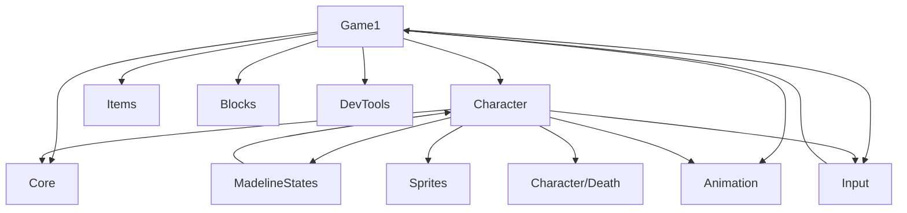

# Team Strawberry — Celeste

**Group:** Strawberry
**Members:** Aaron, Henry, Isaac, Albert, Sihao, Zijun
**Framework:** C# · MonoGame 3.8 · .NET 8.0

---

## Controls

### Player Controls

| Key(s) | Action |
|--------|--------|
| `←` / `→` | Move left / right |
| `↑` / `↓` | Aim dash vertically / climb up or down while grabbing / crouch while grounded |
| `Z` (hold) | Grab / climb |
| `X` | Dash |
| `C` | Jump |
| `C` while sliding on wall | Wall jump / kick off the wall |
| `W` / `A` / `S` / `D` | Testing fallback for directional input |
| `E` | Trigger death sequence (test / demo only) |

### Room / Testing Controls

| Input | Action |
|-------|--------|
| Left mouse | Previous playable room |
| Right mouse | Next playable room |
| `0`-`5` | Jump directly to a room for testing |

### Other Controls

| Key(s) | Action |
|--------|--------|
| `Q` | Quit |
| `Escape` | Open pause menu during gameplay / go back in menus |
| `R` | Reset the current room |
| `F5` / `F6` | Previous / next BGM track |
| `F7` / `F8` | Pause / resume BGM |

### Menu Controls

| Key(s) | Action |
|--------|--------|
| `Up` / `Down` | Move menu selection |
| `Enter` | Confirm current menu option |
| `Escape` | Back out of pause menu / exit from main menu |

### Debug Mode Controls

Debug mode is for developer use only (hair anchor tuning, animation inspection).

| Key | Action |
|-----|--------|
| `G` | Toggle debug overlay |
| `P` | Pause / resume animation |
| `→` / `←` | Step one frame forward / backward (while paused) |
| `Tab` | Cycle to next animation (while paused) |
| `Backspace` | Cycle to previous animation (while paused) |
| `W` / `S` / `A` / `D` | Nudge hair anchor up / down / left / right 1 px (while paused) |
| `C` | Toggle crosshair overlay |

> Full debug workflow documented in [Celeste/Celeste/Animation/README.md](Celeste/Celeste/Animation/README.md) and [Celeste/Celeste/DevTools/DebugMode.md](Celeste/Celeste/DevTools/DebugMode.md).

---

## Known Bugs

Known bugs are tracked in the team Discord server.

---

## Tools

- **[tools/strip_builder.py](tools/strip_builder.py)** — Converts per-frame PNG folders into horizontal sprite strips for MonoGame's animation system (e.g. `Madeline_Assets/Animations/player/idleD/` → `Content/idleD.png`). Requires Pillow; see [tools/README.md](tools/README.md) for usage.
- **Animation system** — Data-driven catalog + clip + controller. See [Celeste/Celeste/Animation/README.md](Celeste/Celeste/Animation/README.md) for full documentation and debug mode workflow.

---

## File Structure

Current layout after the organizational refactor (moves/renames only; no functionality changes):

```
Celeste/Celeste/
  Core/
    Constants/
      GlobalConstants.cs     # Global scale
      PlayerConstants.cs     # Player frame size, movement, physics
      ItemConstants.cs       # Item display positions
      BlockConstants.cs      # Block display position
    GameLoopInterfaces.cs    # IUpdateable, IDrawable
  Character/
    Madeline.cs              # Player entity (sprite, state machine, physics, death)
    Death/                   # Death sequence (sprite + particles + orbit ring)
      DeathEffect.cs, DeathSpritePlayer.cs, ClipPlayer.cs, OrbitRingEffect.cs
      Utils/Easings.cs
      Particles/             # ProceduralParticleTexture, ParticleSystem, Particle, Emitters/
  MadelineStates/            # Player state machine (stand, run, jump, fall, dash, climb, dangle, death)
  Input/
    Controller.cs            # Keyboard, mouse, and gamepad controller implementations
    ICommand.cs, GameCommands.cs, IController.cs, ControllerLoader.cs
  Animation/                 # Catalog, clips, controller, loader, keys
  Sprites/                   # MaddySprite, BodySprite, HairRenderer, hair/bangs data
  Items/                     # ItemAnimation, ItemAnimator, ItemAnimationFactory, CollectibleItem
  Blocks/                    # IBlocks, Blocks, CrushBlock, MoveBlock, Spring, BlockFactory, AllBlocks
  DevTools/                  # DebugOverlay.cs
  Game1.cs, Program.cs
tools/
  strip_builder.py
  README.md
```

**Dependency overview:**


```mermaid
flowchart TB
  Game1[Game1]
  Core[Core]
  Character[Character]
  Input[Input]
  MadelineStates[MadelineStates]
  Animation[Animation]
  Sprites[Sprites]
  Death[Character/Death]
  Items[Items]
  Blocks[Blocks]
  DevTools[DevTools]

  Game1 --> Core
  Game1 --> Character
  Game1 --> Input
  Game1 --> Animation
  Game1 --> Items
  Game1 --> Blocks
  Game1 --> DevTools

  Character --> Core
  Character --> Input
  Character --> MadelineStates
  Character --> Animation
  Character --> Sprites
  Character --> Death

  MadelineStates --> Character

  Input --> Game1
```
