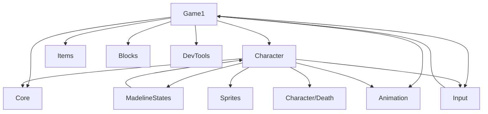

# Team Strawberry — Celeste

**Group:** Strawberry
**Members:** Aaron, Henry, Isaac, Albert, Sihao, Zijun
**Framework:** C# · MonoGame 3.8 · .NET 8.0

---

## Controls

### Player Controls

| Key(s) | Action |
|--------|--------|
| `←` / `→` | Move left / right |
| `↑` / `↓` | Aim dash vertically / climb up or down while grabbing |
| `Z` (hold) | Grab / climb |
| `X` | Dash |
| `C` | Jump |
| `W` / `A` / `S` / `D` | Testing fallback for directional input |
| `E` | Trigger death sequence (test / demo only) |

### Room / Testing Controls

| Input | Action |
|-------|--------|
| Left mouse | Previous playable room |
| Right mouse | Next playable room |
| `0`-`5` | Jump directly to a room for testing |

### Other Controls

| Key(s) | Action |
|--------|--------|
| `Q` / `Escape` | Quit |
| `R` | Reset the current room |

### Debug Mode Controls

Debug mode is for developer use only (hair anchor tuning, animation inspection).

| Key | Action |
|-----|--------|
| `G` | Toggle debug overlay |
| `P` | Pause / resume animation |
| `→` / `←` | Step one frame forward / backward (while paused) |
| `Tab` | Cycle to next animation (while paused) |
| `Backspace` | Cycle to previous animation (while paused) |
| `W` / `S` / `A` / `D` | Nudge hair anchor up / down / left / right 1 px (while paused) |
| `C` | Toggle crosshair overlay |

> Full debug workflow documented in [Celeste/Celeste/Animation/README.md](Celeste/Celeste/Animation/README.md) and [Celeste/Celeste/DevTools/DebugMode.md](Celeste/Celeste/DevTools/DebugMode.md).

---

## Sprint Progress

### Sprint 2 — Game Objects & Sprites

**Due:** Feb 21, 2025 | **Grader Check-In:** Feb 16, 2025 | **In-Class Code Check:** Feb 20, 2025

> **Scope note:** Celeste does not have traditional enemies in this sprint's scope. Enemy / NPC cycling (`O` / `P` as described in the generic sprint template) is deferred to a later sprint when adversarial entities are introduced.

---

#### Sprint 2 Tasks — Henry

- [x] Project management & all documentation
- [x] `tools/strip_builder.py` — animation strip generator helper
- [x] Dynamic hair system (jump, dash, idleA–idleD animations)
- [x] Sprite interface system (`IMaddySprite`, `IBodySprite`, `IHairSprite`)
- [x] Dash hair color configuration (red → blue → red cycle on dash use / refill)
- [x] Hair debug system (G overlay, P pause, WASD nudge, Tab cycle, C crosshair)
- [x] Full repo refactor & folder reorganization

#### Sprint 2 Tasks — Aaron

 - [x] Controller and Command functionality - Create Command and Controller interfaces and classes to initialize, assign, and provide functionality to the project.
 - [ ] Player Control - Needed to consolidate player control handling into the controller structure
 - [x] Project Managment - Set up initial READMe, as well and began pushing other members to create branches to complete tasks in and use Git functionality to track progress.
 - [x] Code Review - Reviewed Henry's Debug system and Isaac's block branch to ensure functionality  

#### Sprint 2 Tasks — Albert

  - [x] Create classes to control in-game animations
  - [x] Added death animations for the player
  - [x] Draw in-game items to cycle through for the sprint

#### Sprint 2 Tasks — Isaac

 - [x] Create classes for drawing static and animated blocks in the game
 - [x] Add moving functionality for necessary blocks
 - [x] Add additional keyboard input (T & Y) for displaying all blocks and the "gallery" of blocks

#### Sprint 2 Tasks — Sihao

 - [x] Implement dashState, climbState and related player movement behavior 
 - [x] Debug and refine animation behavior across different player states
 - [x] Assist with testing player mechanics and ensuring stable gameplay behavior

#### Sprint 2 Tasks — Zijun

  - [x] Character class - Initialize all public characteristics, initialize all states, introduce the simplified physical system, and change the state.
  - [x] State Interface - IMadelineState
  - [x] runState - Handles horizontal movement and transitions to stand/jump/dash based on input and ground check.
  - [x] standState - Initial state. Change to other states base on input.
  - [x] jumpState - Applies initial upward velocity and switches to fall when vertical velocity becomes positive. Permit change to dash state during jumping.
  - [x] fallState - Applies gravity-driven descent and returns to stand upon landing. Permit change to dash state during falling.
  - [x] dangleState - Transitions to climb/jump/fall depending on input and contact.

---

### Sprint 3 — Level Loading, Segmentation, and Collision Handling

**Due:** Mar 14, 2026

**Sprint 3 carry-over into Sprint 4**

- Complete documentation for planning, code reviews, and sprint reflection before submission.
- Ensure room loading is consistently file-driven where intended, not partially hard-coded.
- Add collectible collision so item pickups are functional instead of display-only.
- Fix remaining movement edge cases: wall-slide fallthrough, unsafe respawn points, and climb-through-block behavior.
- Continue reducing oversized responsibilities in `Game1.cs`, especially input and flow control.

### Sprint 4 — Completed First Level

**Start:** Mar 29, 2026 | **Due:** Apr 11, 2026

**Sprint 4 backlog**

- Complete the first playable level with reliable room-to-room progression.
- Keep room teleport/testing controls for fast grading and debugging.
- Add sound effects, background music, and a mute toggle for testing.
- Reset the level cleanly on death.
- Add the HUD and core game flow screens: item/menu selection flow, pause, game over, and win state.
- Continue migrating level data and gameplay constants toward cleaner, more maintainable structures.
- Finish documentation, code reviews, analyzer/code-quality notes, and sprint reflection before submission.

**Internal targets**

- **Apr 4, 2026:** core functionality in place
- **Apr 8, 2026:** code reviews + refactor pass complete
- **Apr 10, 2026:** submission-ready verification and documentation lock

#### Sprint 4 Tasks — Henry

- [ ] Sprint planning leadership, README/sprint documentation, submission checklist, and final sprint integration
- [ ] Refactor core game flow out of `Game1.cs` where practical this sprint
- [ ] Own room transition flow, level reset flow, and high-impact gameplay polish
- [ ] Implement and verify the most score-critical fixes from Sprint 3 feedback
- [ ] Final verification pass on gameplay feel, build health, and grading requirements

#### Sprint 4 Coordination Notes

- Detailed task claiming and day-to-day delegation are managed in team Discord so the README stays submission-friendly.
- Code review evidence is tracked through pull requests and can be supplemented with screenshots in the submission materials when needed.
- Submission-bound work should be merged to `main` by **Friday, Apr 10, 2026** so packaging and documentation checks can be completed before turn-in.

### Sprint 5 — (TBD)

Tasks assigned to individuals: TBD

---

## Sprint Tracking Methodology

To maintain clean, consistent task tracking across all sprints:

1. **Each sprint gets its own section** in this README with dates, scope, and submission-facing notes.
2. **Detailed claiming and day-to-day task movement** are tracked outside the README in the team Discord/task board so this file stays concise.
3. **Responsibility:** Henry maintains the README structure and final submission checklist, while each team member is responsible for keeping their claimed work current in the team workflow tools.
4. **Evidence:** task tracking, code reviews, and related project-management evidence should be preserved through PRs, screenshots, and any submitted supporting documents.

---

## Code Review Methodology

Please use Pull Requests to complete the code review requirements.

**You should not be pulling your own code into the main branch** Other team members need to be responsible for reviewing and merging branches.
**When reviewing code, use the Sprint description to properly fulfill the requirements**
**If screenshots or exported review evidence are needed for submission, capture them before the sprint is turned in**

---

## Known Bugs

Known bugs are tracked in the team Discord server.

---

## Tools

- **[tools/strip_builder.py](tools/strip_builder.py)** — Converts per-frame PNG folders into horizontal sprite strips for MonoGame's animation system (e.g. `Madeline_Assets/Animations/player/idleD/` → `Content/idleD.png`). Requires Pillow; see [tools/README.md](tools/README.md) for usage.
- **Animation system** — Data-driven catalog + clip + controller. See [Celeste/Celeste/Animation/README.md](Celeste/Celeste/Animation/README.md) for full documentation and debug mode workflow.

---

## File Structure

Current layout after the organizational refactor (moves/renames only; no functionality changes):

```
Celeste/Celeste/
  Core/
    Constants/
      GlobalConstants.cs     # Global scale
      PlayerConstants.cs     # Player frame size, movement, physics
      ItemConstants.cs       # Item display positions
      BlockConstants.cs      # Block display position
    GameLoopInterfaces.cs    # IUpdateable, IDrawable
  Character/
    Madeline.cs              # Player entity (sprite, state machine, physics, death)
    Death/                   # Death sequence (sprite + particles + orbit ring)
      DeathEffect.cs, DeathSpritePlayer.cs, ClipPlayer.cs, OrbitRingEffect.cs
      Utils/Easings.cs
      Particles/             # ProceduralParticleTexture, ParticleSystem, Particle, Emitters/
  MadelineStates/            # Player state machine (stand, run, jump, fall, dash, climb, dangle, death)
  Input/
    Controller.cs            # Keyboard, mouse, and gamepad controller implementations
    ICommand.cs, GameCommands.cs, IController.cs, ControllerLoader.cs
  Animation/                 # Catalog, clips, controller, loader, keys
  Sprites/                   # MaddySprite, BodySprite, HairRenderer, hair/bangs data
  Items/                     # ItemAnimation, ItemAnimator, ItemAnimationFactory, CollectibleItem
  Blocks/                    # IBlocks, Blocks, CrushBlock, MoveBlock, Spring, BlockFactory, AllBlocks
  DevTools/                  # DebugOverlay.cs
  Game1.cs, Program.cs
tools/
  strip_builder.py
  README.md
```

**Dependency overview:**


```mermaid
flowchart TB
  Game1[Game1]
  Core[Core]
  Character[Character]
  Input[Input]
  MadelineStates[MadelineStates]
  Animation[Animation]
  Sprites[Sprites]
  Death[Character/Death]
  Items[Items]
  Blocks[Blocks]
  DevTools[DevTools]

  Game1 --> Core
  Game1 --> Character
  Game1 --> Input
  Game1 --> Animation
  Game1 --> Items
  Game1 --> Blocks
  Game1 --> DevTools

  Character --> Core
  Character --> Input
  Character --> MadelineStates
  Character --> Animation
  Character --> Sprites
  Character --> Death

  MadelineStates --> Character

  Input --> Game1
```
